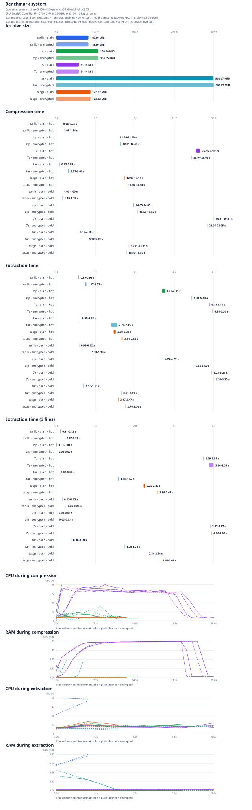

# Linux 4.0.1 Archive Benchmark

Run date: 2026-11-19T14:16:05+01:00
- Operating system: Linux-5.15.0-198-generic-x86_64-with-glibc2.35
- CPU: Intel(R) Core(TM) i7-10700 CPU @ 2.90GHz (x86_64, 16 logical cores)
- Benchmark storage (Source and archives): SSD / non-rotational (may be virtual); model: Samsung SSD 990 PRO 1TB; device: nvme0n1
- Benchmark storage (Extraction output): SSD / non-rotational (may be virtual); model: Samsung SSD 990 PRO 1TB; device: nvme0n1

## Results

Source: [`linux-4.0.1.tar.gz`](https://cdn.kernel.org/pub/linux/kernel/v4.x/linux-4.0.1.tar.gz)
Dataset: source tree
Uncompressed source size: 525.1 MiB
Regular files verified: 48,945
Symbolic links excluded from path/size verification: 12

| Format | Encryption | Cache | Archive size | Compression (min-max) | Extraction (min-max) | Extract 3 files (min-max) | Temp space (3 files) | CPU / RAM (compress) | CPU / RAM (extract) |
|---|---:|---:|---:|---:|---:|---:|---:|---:|---:|
| zarlib | No | hot | 115.2 MiB | 0.99-1.04 s (505.1-529.2 MiB/s) | 0.87-0.87 s (603.3-604.2 MiB/s) | 0.109-0.112 s | 0 B | 0 % / 0.69 GiB | 53 % / 0.56 GiB |
| zarlib | Yes | hot | 115.3 MiB | 1.07-1.11 s (475.0-492.0 MiB/s) | 1.13-1.14 s (460.5-463.0 MiB/s) | 0.204-0.281 s | 0 B | 44 % / 0.33 GiB | 56 % / 0.85 GiB |
| zip | No | hot | 150.3 MiB | 11.77-11.89 s (44.1-44.6 MiB/s) | 4.25-4.44 s (118.2-123.6 MiB/s) | 0.008-0.008 s | 0 B | 13 % / 0.03 GiB | 15 % / 0.00 GiB |
| zip | Yes | hot | 151.6 MiB | 12.23-12.50 s (42.0-42.9 MiB/s) | 5.43-5.48 s (95.8-96.7 MiB/s) | 0.014-0.021 s | 0 B | 16 % / 0.03 GiB | 13 % / 0.00 GiB |
| 7z | No | hot | 81.1 MiB | 26.33-27.11 s (19.4-19.9 MiB/s) | 6.04-6.17 s (85.1-86.9 MiB/s) | 3.776-4.187 s | 0 B | 69 % / 1.54 GiB | 13 % / 0.03 GiB |
| 7z | Yes | hot | 81.1 MiB | 25.82-26.26 s (20.0-20.3 MiB/s) | 6.15-6.35 s (82.7-85.3 MiB/s) | 3.920-3.938 s | 0 B | 65 % / 1.51 GiB | 12 % / 0.03 GiB |
| tar | No | hot | 562.7 MiB | 0.64-0.68 s (775.2-820.0 MiB/s) | 0.97-0.97 s (541.8-541.9 MiB/s) | 0.068-0.068 s | 0 B | 25 % / 0.00 GiB | 16 % / 0.00 GiB |
| tar | Yes | hot | 562.7 MiB | 2.21-2.49 s (210.8-238.0 MiB/s) | 2.21-2.40 s (218.4-237.1 MiB/s) | 1.548-1.617 s | 0 B | 9 % / 0.49 GiB | 11 % / 0.27 GiB |
| tar.gz | No | hot | 122.2 MiB | 12.97-12.97 s (40.5-40.5 MiB/s) | 2.32-2.36 s (222.9-226.8 MiB/s) | 2.291-2.294 s | 0 B | 10 % / 0.01 GiB | 14 % / 0.00 GiB |
| tar.gz | Yes | hot | 122.2 MiB | 13.26-14.01 s (37.5-39.6 MiB/s) | 2.65-2.72 s (193.0-198.1 MiB/s) | 2.641-2.663 s | 0 B | 9 % / 0.01 GiB | 14 % / 0.00 GiB |
| zarlib | No | cold | 115.5 MiB | 1.11-1.11 s (474.6-474.6 MiB/s) | 0.91-0.91 s (577.8-577.8 MiB/s) | 0.178-0.178 s | 0 B | 12 % / 0.60 GiB | 11 % / 0.54 GiB |
| zarlib | Yes | cold | 115.5 MiB | 1.24-1.24 s (425.1-425.1 MiB/s) | 1.25-1.25 s (420.3-420.3 MiB/s) | 0.241-0.241 s | 0 B | 59 % / 0.68 GiB | 44 % / 0.84 GiB |
| zip | No | cold | 150.3 MiB | 14.89-14.89 s (35.3-35.3 MiB/s) | 4.33-4.33 s (121.2-121.2 MiB/s) | 0.018-0.018 s | 0 B | 10 % / 0.03 GiB | 13 % / 0.00 GiB |
| zip | Yes | cold | 151.6 MiB | 15.66-15.66 s (33.5-33.5 MiB/s) | 5.55-5.55 s (94.6-94.6 MiB/s) | 0.025-0.025 s | 0 B | 15 % / 0.03 GiB | 15 % / 0.00 GiB |
| 7z | No | cold | 81.1 MiB | 29.17-29.17 s (18.0-18.0 MiB/s) | 6.13-6.13 s (85.7-85.7 MiB/s) | 3.919-3.919 s | 0 B | 67 % / 1.52 GiB | 11 % / 0.03 GiB |
| 7z | Yes | cold | 81.1 MiB | 27.88-27.88 s (18.8-18.8 MiB/s) | 6.43-6.43 s (81.6-81.6 MiB/s) | 3.969-3.969 s | 0 B | 63 % / 1.48 GiB | 15 % / 0.03 GiB |
| tar | No | cold | 562.7 MiB | 4.17-4.17 s (126.0-126.0 MiB/s) | 1.10-1.10 s (475.5-475.5 MiB/s) | 0.382-0.382 s | 0 B | 15 % / 0.00 GiB | 9 % / 0.00 GiB |
| tar | Yes | cold | 562.7 MiB | 5.97-5.97 s (87.9-87.9 MiB/s) | 2.75-2.75 s (191.2-191.2 MiB/s) | 1.689-1.689 s | 0 B | 7 % / 0.17 GiB | 17 % / 0.27 GiB |
| tar.gz | No | cold | 122.2 MiB | 13.25-13.25 s (39.6-39.6 MiB/s) | 2.45-2.45 s (214.2-214.2 MiB/s) | 2.409-2.409 s | 0 B | 10 % / 0.01 GiB | 12 % / 0.00 GiB |
| tar.gz | Yes | cold | 122.2 MiB | 13.62-13.62 s (38.5-38.5 MiB/s) | 2.75-2.75 s (191.2-191.2 MiB/s) | 2.703-2.703 s | 0 B | 10 % / 0.02 GiB | 11 % / 0.01 GiB |

"Extract 3 files" is the time to extract only `fs/btrfs/check-integrity.c`, `lib/xz/xz_dec_test.c`, `tools/perf/util/build-id.h`
from the archive (for encrypted tar/tar.gz this includes decrypting the archive). "Temp space"
is the peak disk usage of the results directory and the runner's temporary
directory during that extraction minus the size of the extracted files, sampled
every 5 ms (the maximum over all runs). Temporary files outside these
directories (e.g. in the system temp directory) are not captured.

Throughput uses the uncompressed regular-file size. Each extraction was run into
a freshly emptied `testresults/` directory, then checked against the source tree
for matching regular-file paths and sizes. During its 4 extraction run(s), `zarlib` renamed 48 path(s) total (12 per run) due to case-folded collisions; generated suffixes are normalized only for comparison. The results
directory was emptied again after each check. Symlink entries are excluded
from verification. `zarlib` stores links but does not restore them by default;
ZIP and tar restore links, and 7z may skip unsafe relative links during
extraction, as noted above.

CPU utilisation and RAM consumption were sampled at 1-second intervals during
each compression and extraction operation using `psutil`. CPU is system-wide;
RAM is the summed resident set size (RSS) of the archiver process and its
children, excluding the runner and unrelated processes. Shared memory may be
counted more than once. Samples are taken only while a benchmark process is
running; short operations may have no samples and are shown as N/A. The table
shows the average CPU % and RAM GiB across available samples for each phase.
Runtime values show
the minimum and maximum measured time for each phase. The charts plot full
extraction times and the times to extract the three selected files separately.
The time-series charts plot CPU and RAM on separate axes for compression and
extraction, with one line per archive format (solid = plain, dashed = encrypted).
The CPU model and operating system are collected from the host. Storage details
describe the volumes holding the source/archive files and extraction output.
The operating system may not expose physical media behind virtual or layered
storage; such cases are identified as unknown or non-rotational/possibly virtual.

## Method

- **Cache state**: `hot` runs read every file of the source tree (and, before
  extraction, the archive) once before the measured operation. `cold` runs drop
  the operating system file cache before every measured operation: `sync` plus
  writing `3` to `/proc/sys/vm/drop_caches` on Linux (root required), or
  `RAMMap.exe -Et` on Windows (elevation required). Cold runs are skipped with
  a warning when the privileges are missing.
- The installed 7-Zip does not support the zstd codec (only forks such as 7-Zip-zstd do); the `7z-zstd` benchmark is skipped.
- `zarlib`: `zarc` release build, default Zstandard compression level 3;
  encrypted runs use AES-256-GCM and the default header-and-data scope.
- `zip`: Info-ZIP recursive DEFLATE at level 6, storing symlinks as links.
  Encrypted runs use the implementation's standard ZipCrypto mode
  (legacy/weak encryption).
- `7z-zstd`: 7z format with the Zstandard codec at level 3 (only run when the
  installed 7-Zip supports it, e.g. 7-Zip-zstd); otherwise like `7z`.
- `7z`: 7z format with LZMA2 at level 5. Encrypted runs use AES-256 and
  encrypted headers; symlinks are stored as links. The 7-Zip CLI accepts
  passwords only as a command-line switch; this runner generates a temporary
  random password and never saves it. During extraction, 7-Zip rejects
  relative symlink targets containing parent components; the runner
  accepts only the expected warnings for those source links and still
  verifies every regular file.
- `tar`: GNU tar without compression (a pure archiving baseline). The
  encrypted run times tar plus OpenSSL CMS AES-256-GCM encryption and is
  decrypted before extraction, like `tar.gz`.
- `tar.gz`: GNU tar with gzip's default compression level. Since tar.gz has no
  built-in encryption, the encrypted run times tar/gzip plus OpenSSL CMS
  AES-256-GCM encryption. It is decrypted before extraction. A temporary
  self-signed RSA certificate is used to wrap the CMS content key; the
  temporary private key is deleted when the benchmark exits.
- Compression and extraction are measured twice per hot-cache configuration
  and once per cold-cache configuration. The report shows the minimum and
  maximum runtime across those runs. If an archiver command fails in any
  repetition, its configuration is marked FAILED and its error is shown above;
  other runs continue. The runner waits 3 seconds between
  benchmark runs; this delay is not included in the measured operation times.
  Build time, source download/extraction, and post-extraction verification are
  also excluded from the measured operation times.

## Tool versions

- `zarlib`: `0.15.0`
- `cargo`: `cargo 1.99.1 (5f94df478 2026-08-27)`
- `tar`: `tar (GNU tar) 1.34`
- `openssl`: `OpenSSL 3.0.2 15 Mar 2022 (Library: OpenSSL 3.0.2 15 Mar 2022)`
- `7z`: `7-Zip [64] 16.02 : Copyright (c) 1999-2016 Igor Pavlov : 2016-05-21`
- `gzip`: `gzip 1.10`
- `zip`: `This is Zip 3.0 (July 5th 2008), by Info-ZIP.`
- `unzip`: `UnZip 6.00 of 20 April 2009, by Debian. Original by Info-ZIP.`
- `zarc`: `zarc 0.15.0 (mimalloc)`

The generated archives and temporary key material are removed after the run.
The source archive and extracted source trees remain in `testdata/`.
